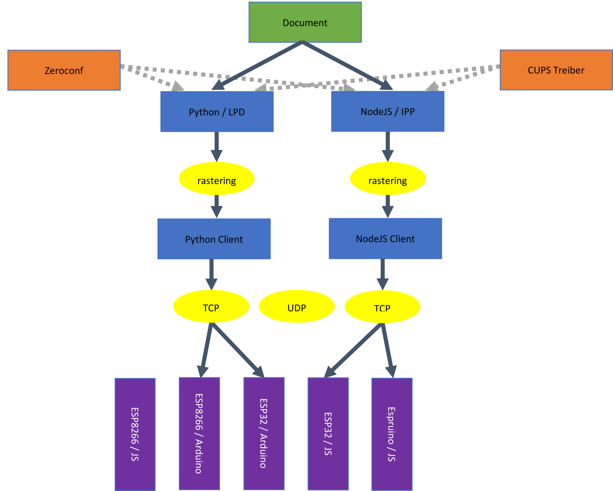

# E-Paper 📄 by Laurin Muth and Andreas Schmid

[GitHub](https://github.com/Lyniat/BA-e-ink/tree/master) / [Log](https://lyniat.github.io/BA-e-ink/)

Includes (as of February 2, 2018):
* [ESP 8266 (WEMOS D1 mini R2)](https://wiki.wemos.cc/products:d1:d1_mini)
* [10.2" E ink Display](http://www.pervasivedisplays.com/products/102)
* [TCM2-P102 Controller](http://www.pervasivedisplays.com/LiteratureRetrieve.aspx?ID=232053)

[CURRENT STATE](#19-01-22)

[TODO](#todo)

## May 3, 2017 by A.S. and R.W. 

* takes ≈ 4.5s on A.S. laptop (Linux)
* if used *SPI.writeBytes()* in a loop, instead of *SPI.transfer()* (ESP8266 specific), it takes ≈ 4s
* 8ms for package in test pattern
* max upload per package to controller are 250 byte (= 2000 pixels)

## January 1, 2018 by L.M. 

### Summary

Two working solutions:
* ESP 8266 (WEMOS D1mini) with Arduino C and Python
* ESP 32 (LOLIN32) with Espruino (JavaScript) and Node

both use a Node server which acts as an IPP network printer

### Detail

#### ESP 8266
* A.S.'s Arduino code
* A.S.'s python code on PC

* takes ≈ 4s for transmission on A.S.'s laptop (Linux)
* takes ≈ 30s for transmission and has huge graphical artifacts on L.M.'s MacBook (MacBook Pro Late 2016, macOS High Sierra v. 10.13.2)
makes no difference if used Python 2.7.10 or Python 3.6.1 or PyPy 2.7.13/5.9.0

* Espruino code does not work atm

#### ESP 32
* L.M.'s Espruino code
* L.M.'s Node code on pc

* takes ≈ 16s on L.M.'s MacBook
* has the additional possibility of rendering text and hosting an AP with Espruino code

* Arduino code does not work atm

## January 08, 2018 by L.M. 

* Created short [demo video](https://www.youtube.com/watch?v=2_70ESpMpT4) with A.S.

## January 10, 2018 by L.M. 

* implemented own LPD [(Line Printer Daemon)](https://en.wikipedia.org/wiki/Line_Printer_Daemon_protocol) server which simulates a network printer
* LPD server is written in Python 2.7 and uses a subset of [RFC1179](http://www.rfc-editor.org/rfc/rfc1179.txt)

## January 11, 2018 by L.M. 

* added [zeroconf](https://pypi.python.org/pypi/zeroconf) to LPD server
* added PIL to script to convert Post Script to PNG
* PIL throws error if *%%BoundingBox* has no values
* fixed this by workaround which copies values from last *%%BoundingBox* entry in file to first one

## January 12, 2018 by L.M. 

* got Arduino code running on ESP32 by changing some socket code in Python
* combined this code with LPD server to get full working print process (most of the time)
* takes ≈ 15s on MacBook for data transmission
* complete time not yet measured

## January 16, 2018 by L.M. 

* added web interface for committing network ssid and password to esp32
* added functions to write / read network ssid and password to/from flash

## January 19, 2018 by L.M. 

* takes also ≈ 15s for data transmission on A.S.'s laptop

## January 25, 2018 by L.M. 

* measured eps32 time on Jürgen Hahns MacBook. same results
* changed to esp8266 and removed **self.sock = socket.socket(socket.AF_INET, socket.SOCK_STREAM)** and **self.sock.setsockopt(socket.IPPROTO_TCP, socket.TCP_NODELAY, 1)**
* time on L.M.'s and J.H.'s MacBook for ESP8266 now ≈ 4s

* ESP32: time for transmission independent from chunk size

* M5STACK (ESP32) also takes ≈ 15s

* switched back to ESP8266 and removes in cause of compatibility the flash read/write function 

## January 28, 2018 by L.M. 

* added debug LEDs
* added functions to write / read network network ssid and password to/from flash again

## February 2, 2018 by L.M. 

* changed code to oo code
* crashes when calling destructor

## February 6, 2018 by L.M. 

* changed code to oo code
* crashes when calling destructor

## February 12, 2018 by L.M. 

* changed some classes to static ones

## February 18, 2018 by L.M. 

* cleaned up and documented C++ code

## February 28, 2018 by L.M. 

* cleaned up and documented Python code

## March 27, 2018 by L.M. 

* tested scripts on Raspberry Pi successfully

## April 24, 2018 by L.M. 

* added reset button

## May 17, 2018 by L.M. 

* added get-ip.sh script to get the E-Papers ip automatically

## June 4, 2018 by L.M. 

* added battery

## January 22, 2019 by L.M. 

* updated ESP32 core to 1.0.1
* this fixed slow TCP connection, so LOLIN D32 PRO will be used for future development

## TODO (might change)

### ❗ high priority️
---

### ❔ low priority
* add possibility of uploading multiple sites
* add buttons
* add case

### 🔍 evaluation
---

